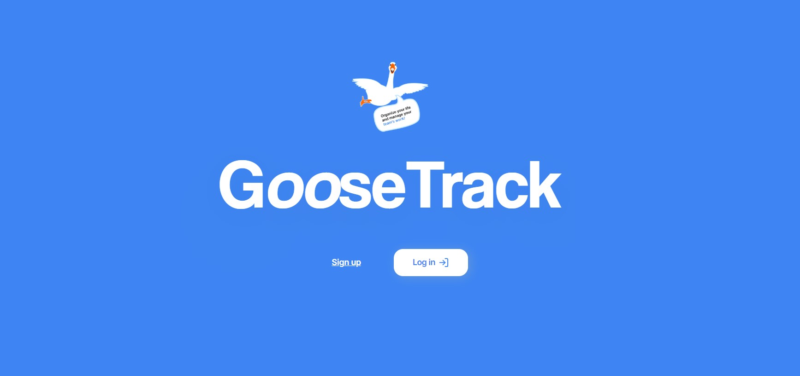
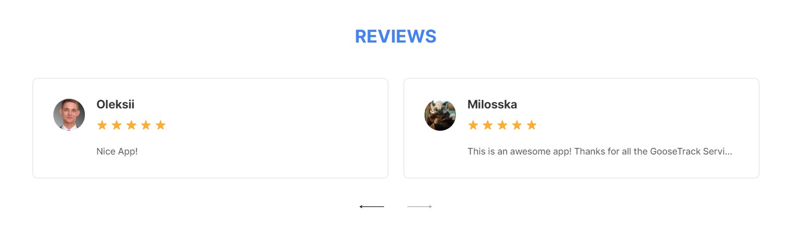
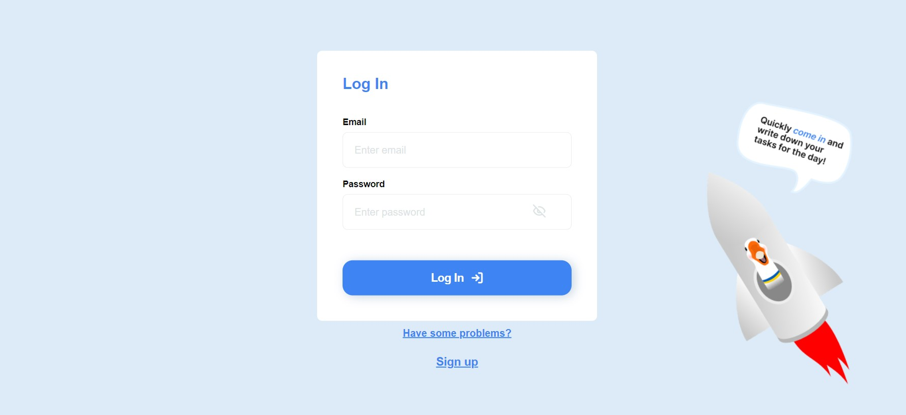
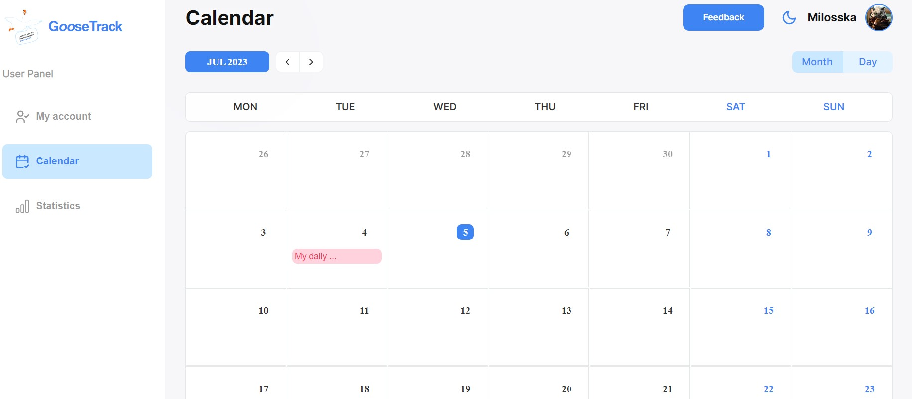
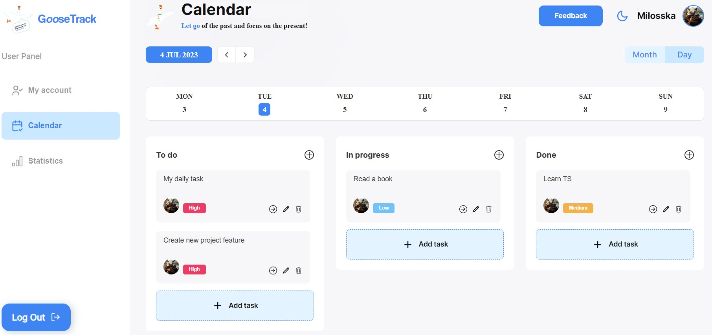
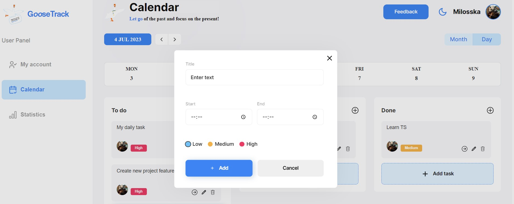
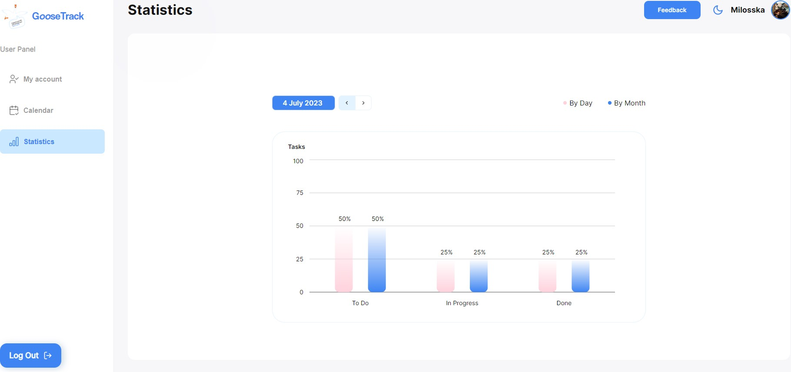
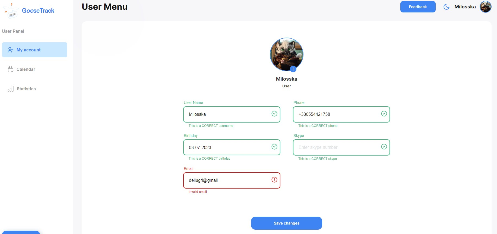
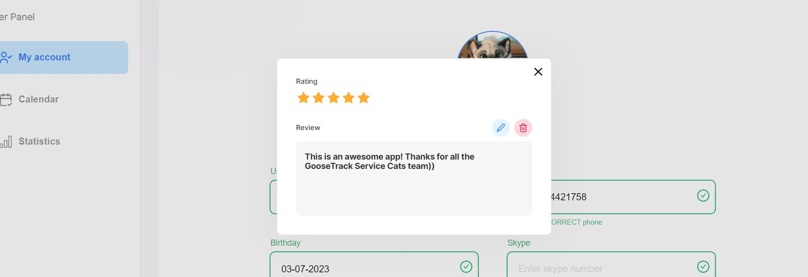
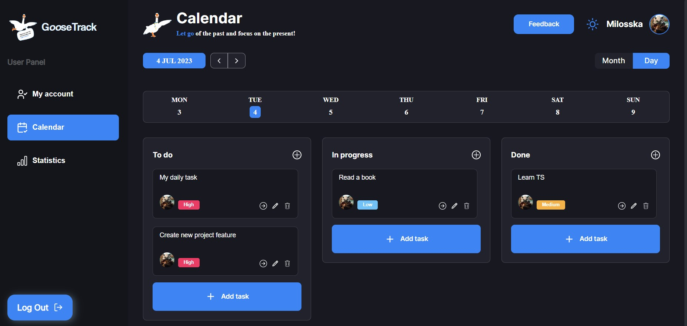

# Goose Track Frontend

This is an adaptive task management tool, created by BioLab team within GoIT academy graduation project. It allows to plan, manage and track all your tasks in one comfortable web app.

## Deploy

The frontend part of the web-app is deployed on gh-pages.
[Live version of the app](https://nastiaknik.github.io/goose-track-frontend/) is avaliable by the web-address

```javascript
"https://nastiaknik.github.io/goose-track-frontend/";
```

## Website content

### Homepage

The App starts with homepage landing demonstrating all the advantages of the app. At the top of the page user can find a navigation panel leading to the login and registration pages.



Under the panel list of app strong points is given. Here one can find information about all the features of the app.

Automatic slider at the end of the page shows current users reviews.



### Registration and login

The registration process is avaliable at the app's registration page. After the registration user should verify given email via recived letter. In case of any problems user can request for sending another verification letter by clicking "Have some problems?" indicator at the end of the page and choosing option "Resend verification email".

The link in the letter redirects user to the app login page.



Login process includes user check via given password and email. To keep user comfortable, and protect his personal data at the same time, we use double token access system at our backend.

### Calendar

The successfull login process will redirect user to the calendar page, where user can see all the tasks planed for current month.



Clicking on the choosen day will redirect user on the daily menu, where all the planed task for the day gathered. At the top of the menu one can find a paginator, helping user comfortably move from day to day.



Task menu helps user reorganize his tasks according to the two main criteria - complition status and difficulty.

Difficalty indicator can be set while creating new tasks and is visible in the form of colored task card lable.

Complition status is indicated in the colums top. User can easily move task card form one column to another, update, or delete tasks by clicking corresponding indicators located at the right bottom corner of each card.

At the bottom of all columns there is a button alllowing to create new task. This button opens a modal window where user can plan a task for a chosen day. The same modl can easily be opened by clicking plus indicated button at the right top corner of each column.



### Statistics

User can check own progress by using statistics page, where all data about tasks complition status gathered. This page provides user with a dynamic histagram indicationg the rate of tasks with each status for the choosen day and for a choosen month.



### Profile

User can also indicate and keep some personal info on the profile page. Here one can update current username, avatar, skype and phone numbers, and email address.

:heavy_exclamation_mark: Pay attention in the case of change user will have to verify new email via service verification letter.



### Additional features

#### Leaving your review

Any page of the web app allows user to leave feedback. The button is located at the right top corner of the viewport, near thr header profile icon. Click on this button will open a modal window, where user can share his opinion on the app. In case if user had already left his review, it will be displayed at the modal window, which allows user to correct given feedback in any convinient time.



#### Theme toggle

Theme toggler button is located at the right top corner of the viewport, near thr header profile icon. Click on this button allows user to choose prefered app color mode.



## Technology stack

Frontend part of the web-app was created using indicated tech stack:

<code></code>
<code></code>
<code></code>
<code></code>
<code></code>
<code></code>
<code></code>
<code></code>
<code></code>
<code></code>
<code></code>
<code></code>

## Team

Frontend part of the project was made by BioLab team members:

| Name                 | GitHub Profile                                          | Сontribution                                                                                                                                                                                                                                                                                                                                                                                                                                                                                             |
| -------------------- | ------------------------------------------------------- | -------------------------------------------------------------------------------------------------------------------------------------------------------------------------------------------------------------------------------------------------------------------------------------------------------------------------------------------------------------------------------------------------------------------------------------------------------------------------------------------------------- |
| Anastasia Knihnitska | [nastiaknik](https://github.com/nastiaknik)             | Project <span style="color:#39835a; font-size:16px; font-weight: 600;">Team Lead</span>. Took charge of repository management, establishing a solid foundation. Added the account page, along with Redux setup for tasks, reviews, and user information. Coordinated teamwork and project tasks.                                                                                                                                                                                                         |
| Liudmyla Deinychenko | [Milosska](https://github.com/Milosska)                 | Project <span style="color:#2596be; font-size:16px; font-weight: 600;">Scrum Master</span>. Crafted front end part of entire authentication process. Implemented login, registration, and logout functionalities with a dual-token system (access and refresh tokens). Handled email verification and form validation. Added a delightful custom loader and readme files to repository. Actively participated in bug fixing, provided team support and motivation.                                       |
| Oleksandr Pastukhov  | [AleksPastukhov](https://github.com/AleksPastukhov)     | Added dynamic calendar pagination components, including the implementation of the Toolbar, Period Type Select, and Calendar Head components. Improved the monthly calendar table and added a preview of tasks. Integrated all necessary components to the calendar page for both the monthly and daily views. This implementation ensures a well-organized and structured display of events and tasks for the entire month, enhancing the user experience and facilitating easy navigation and planning. |
| Andrii Dalekiy       | [andrewfriday13](https://github.com/andrewfriday13)     | Developed MainLayout, SideBar, and Burger Menu components. Fixed various bugs and issues to ensure smooth functionality and improved user experience.                                                                                                                                                                                                                                                                                                                                                    |
| Oleksii Rozhnenko    | [Qwimik](https://github.com/Qwimik)                     | Developed the Main Page with a Review Scroll slider and implemented a "Back to Top" button. Actively tested the project, ensuring its stability and reliability. Diligently addressed and resolved bugs and glitches to enhance overall performance.                                                                                                                                                                                                                                                     |
| Iryna Nosko          | [IrynaVal](https://github.com/IrynaVal)                 | Designed and developed a reusable modal component. Implemented the "Add Task" button and the Task Toolbar to provide users with essential task-related actions and functionalities. Actively participated in bug fixing.                                                                                                                                                                                                                                                                                 |
| Ivan Chmil           | [W1n-chester](https://github.com/W1n-chester)           | Implemented a Theme Toggler to enable seamless switching between light and dark themes. Developed a Statistics page with a visually appealing line chart that showcases the statistics of added, in-progress, and completed tasks.                                                                                                                                                                                                                                                                       |
| Tetiana Tytarenko    | [TetianaTitarenko](https://github.com/TetianaTitarenko) | Added a header displaying user information, including an avatar and username. Implemented a burger menu toggle button for improved navigation. Incorporated a motivational notification with a goose to remind users about pending tasks for the day.                                                                                                                                                                                                                                                    |
| Irina Chernetska     | [Inina125](https://github.com/Inina125)                 | Developed a modal window with a form to facilitate adding, editing, and deleting the user’s review. Users can conveniently interact with the modal to provide feedback or modify the existing review for the application.                                                                                                                                                                                                                                                                                |
| Yehor Kravchenko     | [primarch93](https://github.com/primarch93)             | Worked on implementing the layout for the task columns. Designed and developed the task cards to fit within the columns, enabling users to manage their tasks efficiently for each day.                                                                                                                                                                                                                                                                                                                  |
| Chornyi Yevhenii     | [ChornyiYevhenii](https://github.com/ChornyiYevhenii)   | Designed and developed a modal window with a form for adding, editing, and deleting daily tasks, and also tested the project.                                                                                                                                                                                                                                                                                                                                                                            |
| Osokin Mykyta        | [OsokinNikita](https://github.com/OsokinNikita)         | Created a layout using grid-based styling for the monthly calendar table.                                                                                                                                                                                                                                                                                                                                                                                                                                |
